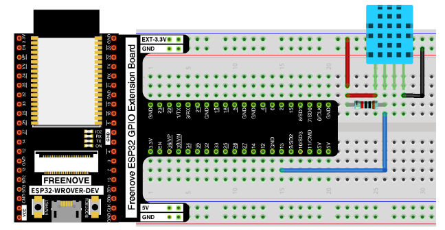
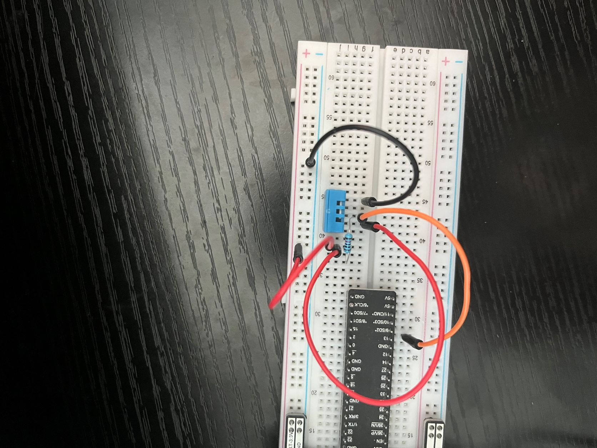
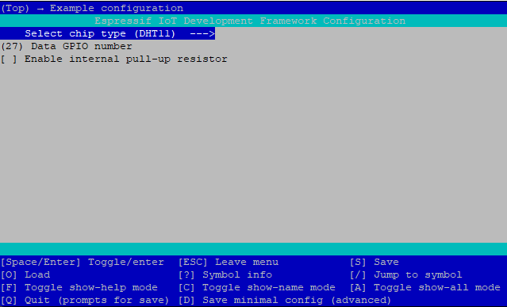
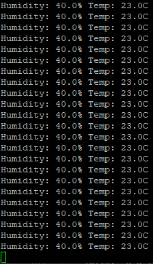
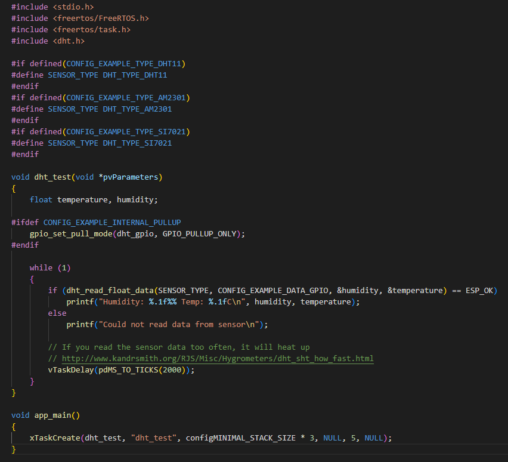
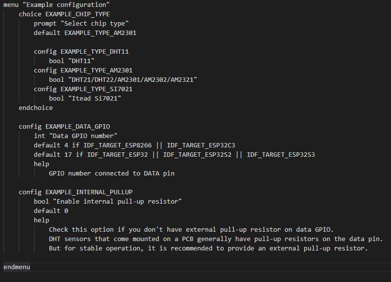
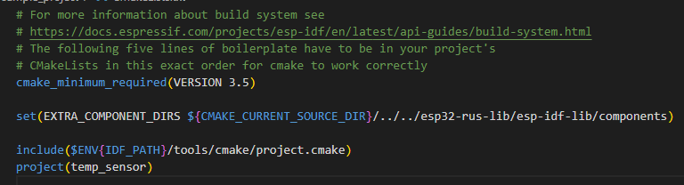

# DHT Tutorial (Temperature & Humidity Sensor)
https://github.com/UncleRus/esp-idf-lib/tree/master/examples
This tutorial shows the user how to set up the Pi to continuously read and print the temperature and humidity of the environment using a DHT sensor.

# Preqequisites
1. A Raspberry Pi with an ESP-32 development environment set up. This can be found [here](https://github.com/pschragger/IOT_Tutorials_for_VU/tree/main/RPI_ESP_IDF_tutorial).
2. A Wifi router, connected to the router and laptop. The admin permissions are needed on this router.
3. A laptop, connected to the same network as the Pi.
4. A DHT11 chip. 

This tutorial will assume the user can compile and run ESP32 projects without issue.

# Setup Project
1. setup the project directory:
    ```
    cd ~/esp
    cp -r ./esp-idf/examples/get-started/sample_project/ .
    ```

    - setup the driver installation for DHT11
    ```
    cd ~
    mkdir esp32-rus-lib
    cd esp32-rus-lib
    git clone https://github.com/UncleRus/esp-idf-lib.git
    ```
    - now we must go to our project makefile and include these dependencies.
    ```
    cd ~/esp/sample_project
    nano CMakeLists.txt
    ```

    - edit the CMakeLists.txt file:
    ```
    cmake_minimum_required(VERSION 3.5)

    set(EXTRA_COMPONENT_DIRS ${CMAKE_CURRENT_SOURCE_DIR}/../../esp32-rus-lib/esp-idf-lib/components)

    include($ENV{IDF_PATH}/tools/cmake/project.cmake)
    project(temp_sensor)
    ```
    ```
    idf.py set-target esp32
    idf.py fullclean
    idf.py build
    ```

    - make sure the project builds with the new component inputs.

2. Setup the circuit:
    - obtain the following:
        - ESP32 WROVER
        - Breadboard
        - GPIO Extension Board
        - 4x Jumper Wires
        - DHT11
        - 10k Ohms Resistor

    - When looking at the DHT11 from the front (the side with the holes), there are 4 pins. From left to right they are:

        1. VCC (power)
        2. SDA (data)
        3. NC (not connected)
        4. GND (ground)

    - Connect the following:
        - pin 1 to 3.3V power.
        - pin 2 to 3.3v power, through the 10k Ohms resistor
        - pin 2 to GPIO 27
        - pin 4 to ground

    
    
    - note: in this image I have connected the data line to pin 13, this is wrong, connect the data pin to pin 27.

3. Modify the code from the tutorial.

For this part of the tutorial, I used VSCode to SSH into the Pi to modify files. A tutorial on how to set this up can be found [here](https://code.visualstudio.com/docs/remote/ssh).

- navigate to the main folder in the temp_humidity project.
- in the main folder, open the main.c file

- in the file, begin writing the code
    ```
    #include <stdio.h>
    #include <freertos/FreeRTOS.h>
    #include <freertos/task.h>
    #include <dht.h>

    #if defined(CONFIG_EXAMPLE_TYPE_DHT11)
    #define SENSOR_TYPE DHT_TYPE_DHT11
    #endif
    #if defined(CONFIG_EXAMPLE_TYPE_AM2301)
    #define SENSOR_TYPE DHT_TYPE_AM2301
    #endif
    #if defined(CONFIG_EXAMPLE_TYPE_SI7021)
    #define SENSOR_TYPE DHT_TYPE_SI7021
    #endif

    void dht_test(void *pvParameters)
    {
        float temperature, humidity;

    #ifdef CONFIG_EXAMPLE_INTERNAL_PULLUP
        gpio_set_pull_mode(dht_gpio, GPIO_PULLUP_ONLY);
    #endif

        while (1)
        {
            if (dht_read_float_data(SENSOR_TYPE, CONFIG_EXAMPLE_DATA_GPIO, &humidity, &temperature) == ESP_OK)
                printf("Humidity: %.1f%% Temp: %.1fC\n", humidity, temperature);
            else
                printf("Could not read data from sensor\n");

            // If you read the sensor data too often, it will heat up
            // http://www.kandrsmith.org/RJS/Misc/Hygrometers/dht_sht_how_fast.html
            vTaskDelay(pdMS_TO_TICKS(2000));
        }
    }

    void app_main()
    {
        xTaskCreate(dht_test, "dht_test", configMINIMAL_STACK_SIZE * 3, NULL, 5, NULL);
    }
    ```
    - In the main/ folder, create a file called "Kconfig.projbuild"
        ```
        menu "My Configuration"
            choice EXAMPLE_CHIP_TYPE
                prompt "Select chip type"
                default EXAMPLE_TYPE_DHT11

                config EXAMPLE_TYPE_DHT11
                    bool "DHT11"

            endchoice

            config EXAMPLE_DATA_GPIO
                int "Data GPIO number"
                default 13
                help
                    GPIO No. connected to DATA pin

            config EXAMPLE_INTERNAL_PULLUP
                bool "Enable internal pull-up resistor"
                default 0
                help
                    Check this option if you don't have external pull-up resistor on data GPIO. DHT sensors that come mounted on a PCB generally have pull-up resistors on the data pin. But for stable operation, it is recommended to provide an external pull-up resistor.
        endmenu
        ```

    - In the root folder of the project, run:
        ```
        idf.py fullclean
        idf.py menuconfig
        *** Here configure the GPIO Pin and Resistor pullup options. DHT11, 27 & off
        idf.py set-target esp32
        idf.py build
        ```

    

    - After the project builds, we must flash it.
    ```
    lsusb
    ```
    - yeilds
    ```
    Bus 002 Device 001: ID 1d6b:0003 Linux Foundation 3.0 root hub
    Bus 001 Device 003: ID 1a86:7523 QinHeng Electronics CH340 serial converter
    Bus 001 Device 002: ID 2109:3431 VIA Labs, Inc. Hub
    Bus 001 Device 001: ID 1d6b:0002 Linux Foundation 2.0 root hub

    ```
    - The CH340 Serial Converter is the target we want.
    - Find the port number
    ```
    ls -l /dev/ttyUSB*
    ```
    yields
    ```
    crw-rw---- 1 root dialout 188, 0 Sep 23 03:17 /dev/ttyUSB0
    ```
    - my device was in port 0.
    ```
    sudo cmod 666 /dev/ttyUSB0
    idf.py -p 0 flash
    ```

    - monitor the outputs
    ```
    idf.py -p /dev/ttyUSB0 monitor
    ```
    - below is an example output of the program.

    

# References
https://github.com/pschragger/IOT_Tutorials_for_VU/tree/main/RPI_ESP_IDF_tutorial
https://github.com/UncleRus/esp-idf-lib/tree/master/examples/dht/default
( for code & examples)

# More images

- above is a picture of the code, as displayed in vscode ssh.

- above is an image of the projbuild file, allowing us to configure the project.

- above is the cmakelists.txt file showing the import of the dht driver.
    