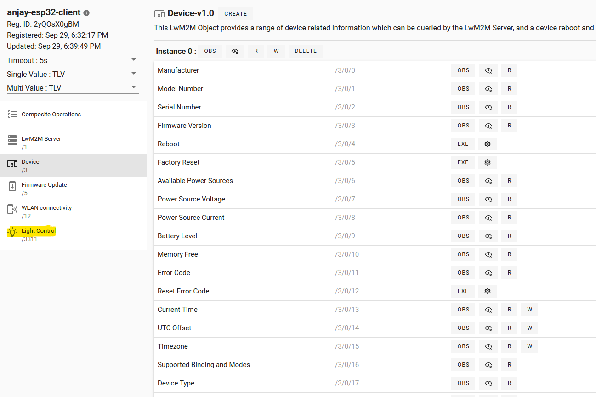
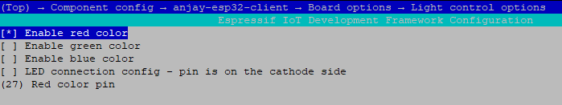
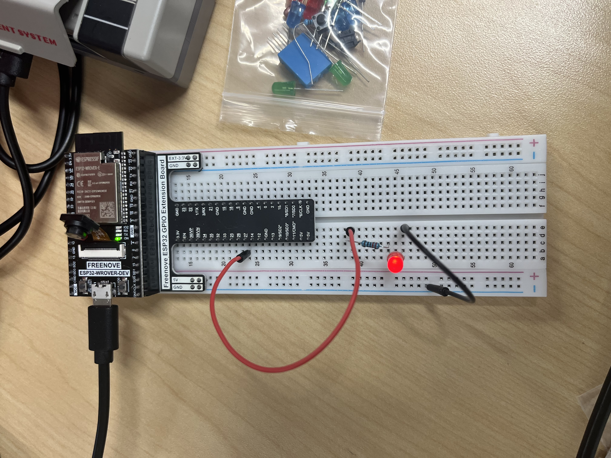
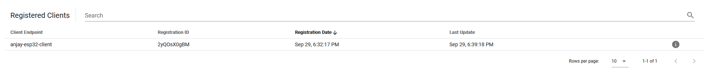
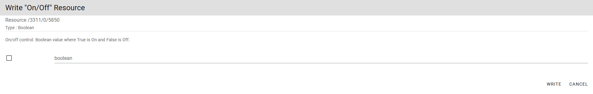
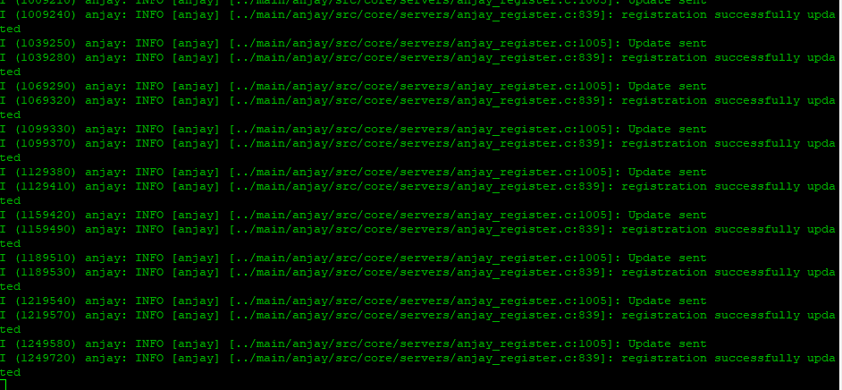
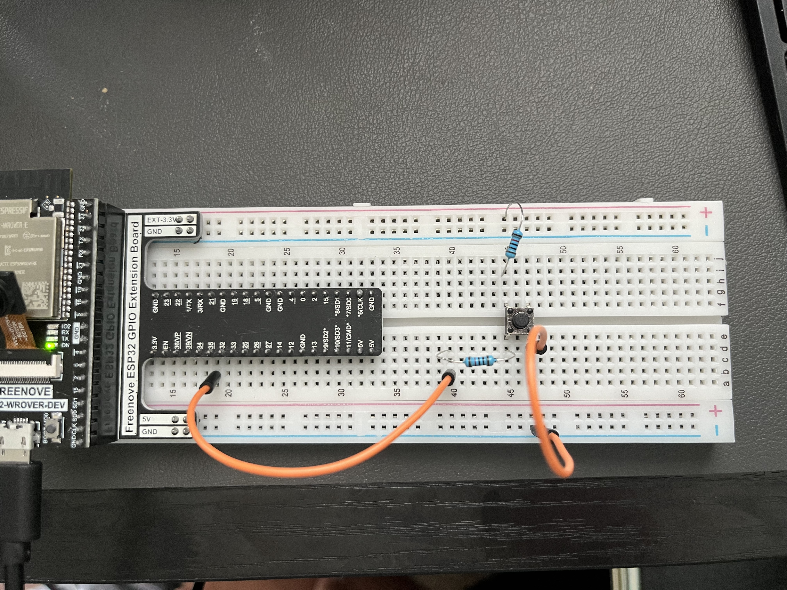
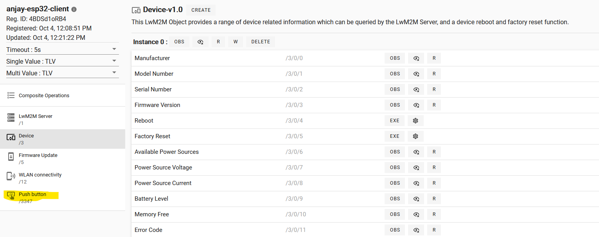
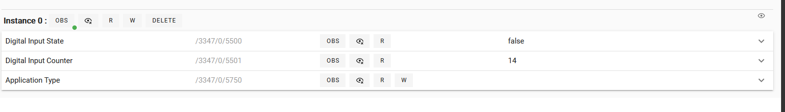

# Anjay Leshan Client
This tutorial outlines the method in which to set up some devices on the ESP32-WROVER chip.

# Prerequisites
1. A laptop, connected to a router
2. A router
3. A raspberry pi
4. A ESP32 WROVER device

This tutorial will assume the user to have installed everything necessary for it. The Anjay setup can be found [here](https://github.com/pschragger/IOT_Tutorials_for_VU/tree/main/RPI_BUILD_LWM2M_DEVICE) and the repo for the Anjay Client can be found [here](https://github.com/AVSystem/Anjay-esp32-client). The Leshan server demo can be found [here](../LWM2M_installation_experiments/README.md). The IDF tutorial can be found [here](https://github.com/pschragger/IOT_Tutorials_for_VU/tree/main/RPI_ESP_IDF_tutorial).

# Light Control Configuration
This tutorial will show how to control a light through the Leshan server. This begins assuming the Anjay client is able to connect to the leshan server and the Leshan server is running. View the tutorials above to set those up.

```
cd ~/projects/leshan/
java -jar leshan-server-demo/target/leshan-server-demo-2.0.0-SNAPSHOT-jar-with-dependencies.jar &
```

- To start, navigate to the anjay_client and open the menuconfig
    ```
    cd ~/projects/Anjay-esp32-client
    idf.py menuconfig
    ```
    - note: to accomplish this step, be sure to export the esp project.
        ```
        . ~/esp/esp-idf/export.sh
        ```

- navigate to component config
- scroll to anjay-esp32-client
- open board options
- select *light control* by pressing space

- scroll to light control options
- check enable red color
- scroll to red color pin and input *27*.

- be sure to set up client connection options with the ssid and key to access the wifi
- be sure to set up the client options to connect to the proper server with no security (this step and the previous should have been completed in previous tutorials)

## Setup the circuit
- This circuit is a simple LED circuit. Connect a wire from pin 27 to an empty row on the breadboard. From the empty row connect a resistor to another empty row. Then connect the positive end of the led to the resistor, and a wire running from the negative end to ground.


## Control the Light 

- Open the Leshan demo server on a web browser (192.168.8.119:8080) (this may change from demo to demo)

- click the anjay client from the clients menu


- on the left hand side, click light control


- Here there are on/off and dimmer. Click the "w" next to on/off and type "true" into the entry box and click "write"


- Click the "w" next to dimmer and experiment with different values between 1-100. The two I recommend are 10 and 100, to notice the color differences.

- open a monitor on the esp32 program
    ```
    cd ~/project/Anjay-esp32-client
    idf.py -p /dev/ttyUSB0 monitor
    ```
- here you can see the communications from the client to the server


# Pushbutton Control Configuration
- Start the leshan server
    ```
    cd ~/projects/leshan/
    java -jar leshan-server-demo/target/leshan-server-demo-2.0.0-SNAPSHOT-jar-with-dependencies.jar &
    ```

- Export the idf.py commands
    ```
    . ~/esp/esp-idf/export.sh
    ```

- Open the menuconfig for the anjay client
    ```
    cd ~/projects/Anjay-esp32-client/
    idf.py menuconfig
    ```

- setup the pushbutton
    - scroll to component config, press enter
    - scroll to anjay-esp32-client and press enter
    - select board options, then select push button
    - set a pin for the pushbutton, i did pin 35

- build the project
    ```
    idf.py build
    ```

## Circuit setup
- attach a jumper to the pin assigned above, for me it was pin 35
- from the jumper run a 10k Ohms resistor to one end of the pushbutton. 
- attach ground to to the other side of the pushbutton
- attach a 3.3v through a 10k resistor connected to the same side as the pin connection.



## Monitor the button pushes
- flash the program (now built) onto the esp32 board
    ```
    chmod 666 /dev/ttyUSB*
    ```
    here, the * is the usb port number the esp is plugged into. for me, it is usb0
    ```
    idf.py flash -p 0
    ```

- load the leshan server and observe the button pushes.
- navigate to {RPI_IP_ADDR}:8080, where the leshan server web page is

- select the anjay-esp32-client


- on this page, it displays the input state (true/false) and the counter of how many times the button has been pushed.


- on the top of the page, click the button "OBS" to begin observing the values. A small green circle will appear on the button and the values of the state and counter will populate

- On the circuit, press the pushbutton and look at the input counter. it will increase by one.
    - press and hold the button to notice the input state change to true. release it and it will return to false.

 

