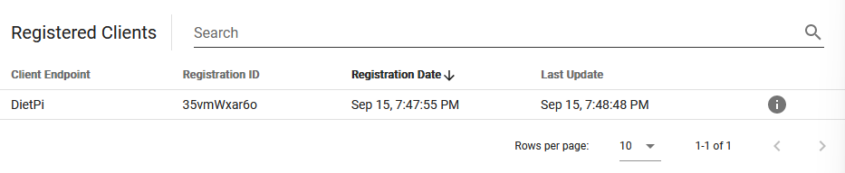
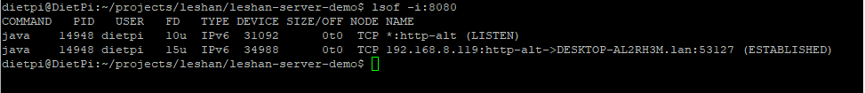
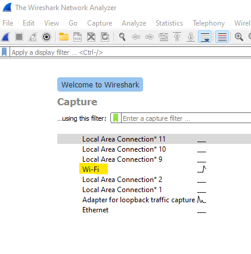
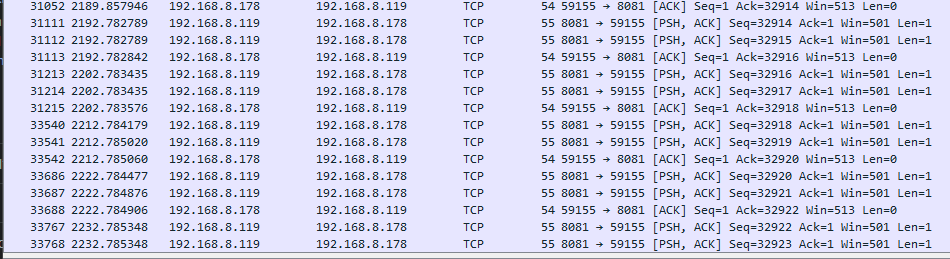

# Device Management Install Tutorial
This tutorial follows those from the following [tutorial](https://github.com/pschragger/IOT_Tutorials_for_VU/tree/main/RPI_DEVICE_MANAGEMENT_INSTALL_tutorial)

## Prerequisites
1. A laptop connected to the same network as a RPi and an internet connection.
2. A Raspberry Pi with dietpi installed and connected to the same internet as the laptop.
3. Access to the lwm2m server/client code from the eclipse [project](https://www.eclipse.org/leshan/)

### Install development environment on RPI
- Install git
    - one a command line (assuming you are connected to the dietpi user in the pi) enter the following command
    ```
    sudo dietpi-software
    ```
    - search for git (possibly package 17) and select it using spacebar (an asterick [*] will appear).
    - press tab to move to "ok" and press enter to enter.
    - scroll to install and press enter to install. tab to "ok" and press enter. the screen should show commands indicating software being installed. 
    - ensure git is installed by running:
    ```
    git --version
    ```
2. Install Java JDK
    - on the command line (dietpi user), launch the software portal and run:
    ```
    sudo dietpi-software
    ```
    - scroll to search software and search "java". select package 8: "Java JDK: OpenJDK Development Kit".
    - press tab to "ok" and enter. scroll to install and press enter. tab to "ok" and press enter again.
    - Java will begin installing, it may take a few minutes.
    - After installation, run:
    ```
    java --version
    ```
    to check Java installed correctly.

3. Install Maven
    - in the home directory of the dietpi user, create a folder called download and move to it:
    ```
    mkdir download
    cd download
    ```
    - install the latest Maven install using the following command. check the [apache site](https://maven.apache.org/download.cgi) for the latest link version.
    ```
    wget https://dlcdn.apache.org/maven/maven-3/3.8.6/binaries/apache-maven-3.8.6-bin.tar.gz
    ```
    - unpack the tarball. note: replace the name if you've installed another version of Maven.
    ```
    tar xzvf apache-maven-3.8.6-bin.tar.gz
    ```

    - add Maven to the PATH variable.
    ```
    echo 'PATH="${PATH}:~/download/apache-maven-3.8.6/bin"' >>  ~/.bashrc
    ```
    - test Maven is installed and is on the PATH variable:
    ```
    bash
    mvn -v
    ```
    - Output:
    ```
    dietpi@DietPi:~/download$ mvn -v
    Apache Maven 3.8.6 (84538c9988a25aec085021c365c560670ad80f63)
    Maven home: /home/dietpi/download/apache-maven-3.8.6
    Java version: 17.0.4, vendor: Debian, runtime: /usr/lib/jvm/java-17-openjdk-arm64
    Default locale: en_US, platform encoding: UTF-8
    OS name: "linux", version: "5.15.61-v8+", arch: "aarch64", family: "unix"
    ```

4. Add JAVA_HOME to the PATH variable
    - Add JAVA_HOME to the .bashrc file we were editing earlier.
    ```
    sudo echo 'JAVA_HOME="/usr/lib/jvm/java-17-openjdk-arm64"' >> ~/.bashrc
    ```
    - check this exists.
    ```
    sudo nano ~/.bashrc
    ```
    here you should see the PATH variable containing the bin directory for Maven, as well as the JAVA_HOME variable. use ctrl+x to exit nano.

5. Install node.js
    - run:
    ```
    sudo dietpi-software
    ```
    - navigate to search software and search for node
    - install node.js (package 9) using instructions above.
    - to verify install:
    ```
    node
    ```
    - a command prompt for node should load. use .exit to exit this prompt.

6. Install leshan git and build
    - navigate to the root directory of dietpi. this is where the download folder is
    - clone the [leshan git](https://github.com/eclipse/leshan) repo:
    ```
    cd
    mkdir projects
    cd projects
    git clone https://github.com/eclipse/leshan.git
    ```
    - after git installs the repo, we need to build the project
    ```
    cd leshan
    mvn clean install
    ```
    - this build could take 20+ minutes to complete

## Start the Leshan Server
1. Start the server

    ```
    cd
    cd projects/leshan
    java -jar leshan-server-demo/target/leshan-server-demo-*-SNAPSHOT-jar-with-dependencies.jar &
    ```
    
    - on the laptop, connect the leshan server using
        ```
        http://{RPI_IP_ADDR}:8080
        ```
    - this will bring up the register client web page.

    - run the leshan client
    ```
    java -jar leshan-client-demo/target/leshan-client-demo-*SNAPSHOT-jar-with-dependencies.jar
    ```
    - go back to the register client webpage and notice the dietpi client listed.


# Experiments
## Killing a process (or server)
1. install lsof
    ```
    sudo apt-get install lsof
    ```
    - check the process id running on port 8080
    ```
    lsof -i:8080
    ```
    - check the process id listed. for me its 14948

2. kill the process
    ```   
    kill *pid*
    ```

## Bootstrap Server / Client
1. Kill the process using the instructions above. (if a server is running)
2. Start the bootstrap server:
    ```
    cd
    cd projects/leshan
    java -jar leshan-bsserver-demo/target/leshan-bsserver-demo-2.0.0-SNAPSHOT-jar-with-dependencies.jar &
    ```
    - this will start the bootstrap server

## Tracking packets using Wireshark
1. Launch Wireshark. Wireshark can be downloaded [here](https://www.wireshark.org/download.html)

2. From the dropdown menu, select Wi-Fi


3. The Wireshark application will begin capturing packets on the network.

4. Launch a server. On the Raspberry Pi, enter the following:
    ```
    cd
    cd projects/leshan
    java -jar leshan-server-demo/target/leshan-server-demo-*-SNAPSHOT-jar-with-dependencies.jar &
    ```

5. Open the server's website @ {RPI_IP_ADDR}:8080

6. Register a client. This client CANNOT be from the Pi. I used an Ubuntu shell from my laptop. This part of the tutorial will be tailored for the Ubuntu shell.

7. Open the Ubuntu shell, create a folder where we will download some things. For me, I made a folder in the home directory. Change into the newly made folder and run the following command. This will install a pre-compiled version of the client demo.
    ```
    wget https://ci.eclipse.org/leshan/job/leshan/lastSuccessfulBuild/artifact/leshan-client-demo.jar
    ```

8. To run this demo, enter the following command: 
    ```
    java -jar ./leshan-client-demo.jar -u {RPI_IP_ADDR}
    ```

The command will spit out that it has registered to a server and will continue to post registration updates.

9. Back in Wireshark, look for packets between the server and client IP's. For me, I looked for packets between my laptop and my RPi (192.168.8.178 & 192.168.8.119)
    - To make this easier, I applied a search filter. Change the two IP addresses used to locate the packets we are looking for.
        ```
        (ip.src==192.168.8.178 and ip.dst==192.168.8.119) or (ip.src==192.168.8.119 and ip.dst==192.168.8.178)
        ```

10. There are PSH, ACK and ACK messages which represent the client/server maintenence packets being exchanged.


