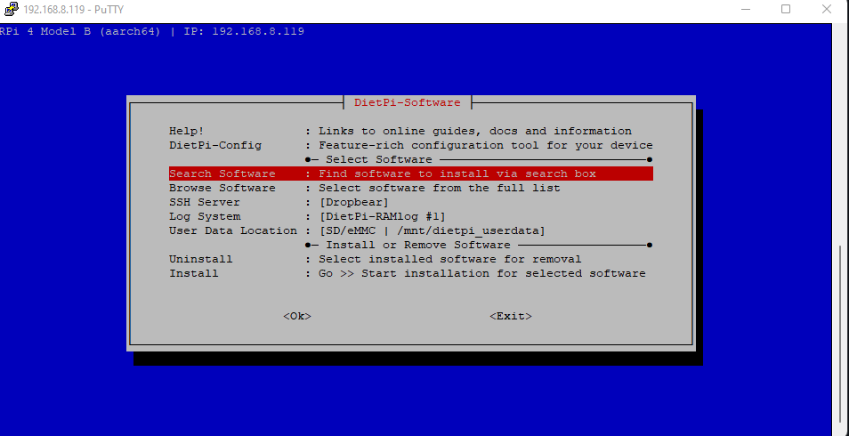
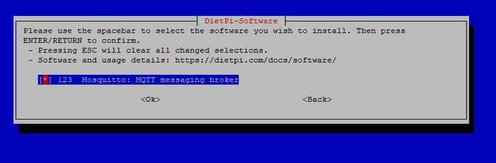
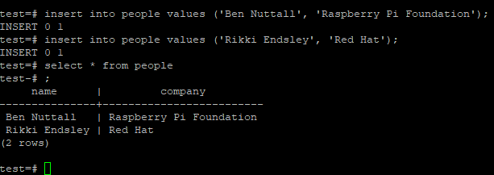
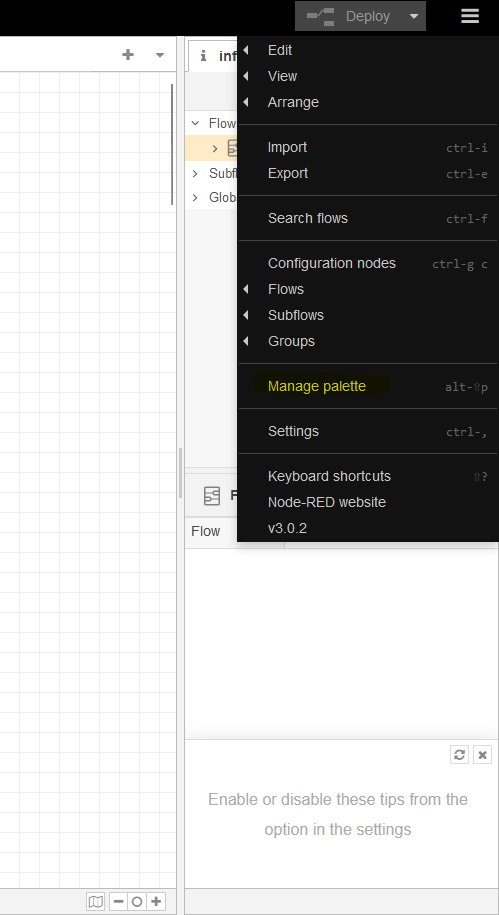
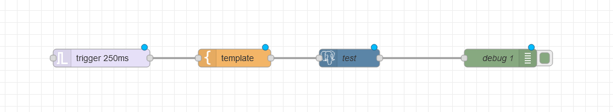

# IOT Platform Install
# Purpose
The purpose of this file is to show the user how to set up the software to run an Internet of Things platform.

# Prerequisites
1. A laptop connected to WiFi
2. A Raspberry Pi running DietPi, connected to the same WiFi source.

    A tutorial on how to do this is shown [here](./RPI_OS_SETUP.md)

# Procedure
## Connect to the RPi
- SSH into the RPi using the dietpi user
```
ssh dietpi@[IPAddress of RPi]
```
The IP address for the RPi can be found on the admin page of the router, more information about connecting to the RPi can be found [here](./RPI_OS_SETUP.md)

Note: This connection can also be done using PuTTY.


## Install Software on the RPi
- Run the following command
```
sudo dietpi-software
```
-   The screen should look as follows:


- Navigate to "Search Software" and enter *mqtt* in the search box. Press the space bar to select it and press enter (OK)


- Following the same steps as above, search for node-red and select "Node-Red: tool for wiring devices, APIs and online services"

    Also search for "postgres" and install "PstgresSQL: Persistent advanced object-relational database server" 

- Scroll down to "Install", press enter. The following screen will list the softwares we will install. Verify the three are there:
```
 The following software will be installed:                                                                         │
│  - Node-RED: tool for wiring devices, APIs and online services                                                    │
│  - Mosquitto: MQTT messaging broker                                                                               │
│  - PostgreSQL: Persistent advanced object-relational database server 
```
    
- Press tab to OK, and press enter. The Pi will begin installing these.
- Note: this may take a while (~10 mins). After the install, reboot the pi and SSH back into it as the dietpi user.

## PostgreSQL setup
Make sure Postgres is installed before moving onto these steps.

- On the RPi, run the command:
```
sudo su postgres
```
This will switch you to the postgres user, the prompt should look something like this:
```
postgres@DietPi:
```
- Create a user by entering the following command:
```
createuser pi -P --interactive
```
- When prompted, enter a password (and remember it) for this user, enter "n" for superuser, and "y" for creating databases and new users.

- Connect to postgres using the shell and create a test database by launching the Postgres shell:
```
psql
```
- create a test db:
```
create database test;
```

- Enter ctrl+d to exit the shell. Again to exit the postgres user. You should now be the dietpi user again.

- Enter back into the postgres user
```
sudo su postgres
```
```
psql test
```
- In the shell:
```
create table people(name text, company text);
```


- Add data into the table:
```
insert into people values ('Ben Nuttall', 'Raspberry Pi Foundation');
insert into people values ('Rikki Endsley', 'Red Hat');
```
- Verify the insertion worked:
```
select * from people;
```


- For our configuration, we must make a few changes to the system files. This issue/change is explained [here.](https://stackoverflow.com/questions/29712228/node-postgres-get-error-connect-econnrefused)
    - Change back to the dietpi user using ctrl+d.
    - Run the following command:
    ```
    cd /etc/postgresql/13/main/
    ```
    - You should now be in the main folder for postgres, run the following command:
    ```
    sudo nano postgresql.conf
    ```
    Change the line from:
    ```
    #listen_addresses = 'localhost'
    ```
    to:
    ```
    listen_addresses = '*'
    ```
    - Doing this will allow the RPi's postgres service to receive all traffic. Note that this is no longer secure because now anybody can connect.
    - Exit nano by first saving the file (ctrl+s) and then exiting (ctrl+x)

- Restart the postgres service:
```
sudo dietpi-services restart postgresql
```
- Check the logs to see if postgresql service has started up TCP services.
```
sudo cat /var/log/postgresql/postgresql-13-main.log
```
Towards the bottom of the log (above our cursor), there should be a line saying db system is ready to accept connections:
```
2022-09-13 16:46:35.691 EDT [519] LOG:  shutting down
2022-09-13 16:46:35.739 EDT [517] LOG:  database system is shut down
2022-09-13 16:46:36.071 EDT [1357] LOG:  starting PostgreSQL 13.8 (Debian 13.8-0+deb11u1) on aarch64-unknown-linux-gnu, compiled by gcc (Debian 10.2.1-6) 10.2.1 20210110, 64-bit
2022-09-13 16:46:36.071 EDT [1357] LOG:  listening on Unix socket "/run/postgresql/.s.PGSQL.5432"
2022-09-13 16:46:36.089 EDT [1358] LOG:  database system was shut down at 2022-09-13 16:46:35 EDT
2022-09-13 16:46:36.104 EDT [1357] LOG:  database system is ready to accept connections
```
## Node-Red Setup
- Connect to node-red to see that it is running by using the RPi's ip address. Enter the following in a web browser:
    ```
    http://{RPI_IP_ADDRESS}:1800
    ```
- Back in the shell command line, install node-red-contrib-re-postgres:
    ```
    sudo npm install node-red-contrib-re-postgres
    ```
- Restart node-red
    ```
    sudo dietpi-services restart node-red
    ```

- In the upper right hand corner of the screen, select the three bars dropdown menu. From here, select *Manage Palette*. You can also use keystrokes "alt+p".


- Under "palette" select install and search for "node-red-contrib-postgresql".

- Click install, then click install again. The program will note when the package is installed.

- Back on the main page, on the left hand side, filter for node "postgresql". Drag a postgres node into the wave board.

- Double click on the node to edit it. Change the following:
    - Give the node a name.
    - Configure a new server instance, give that a name.

- Connect more nodes and wire them as follows:

    - trigger
    - template
    - debug
    The above nodes will need to be dragged in.


