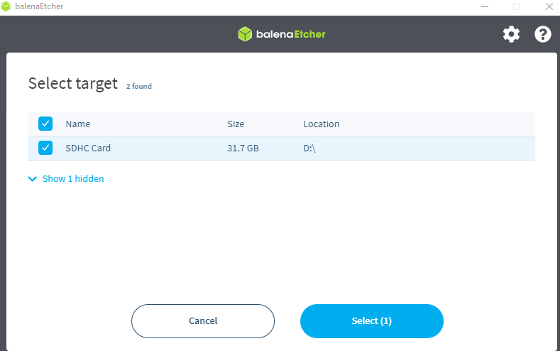
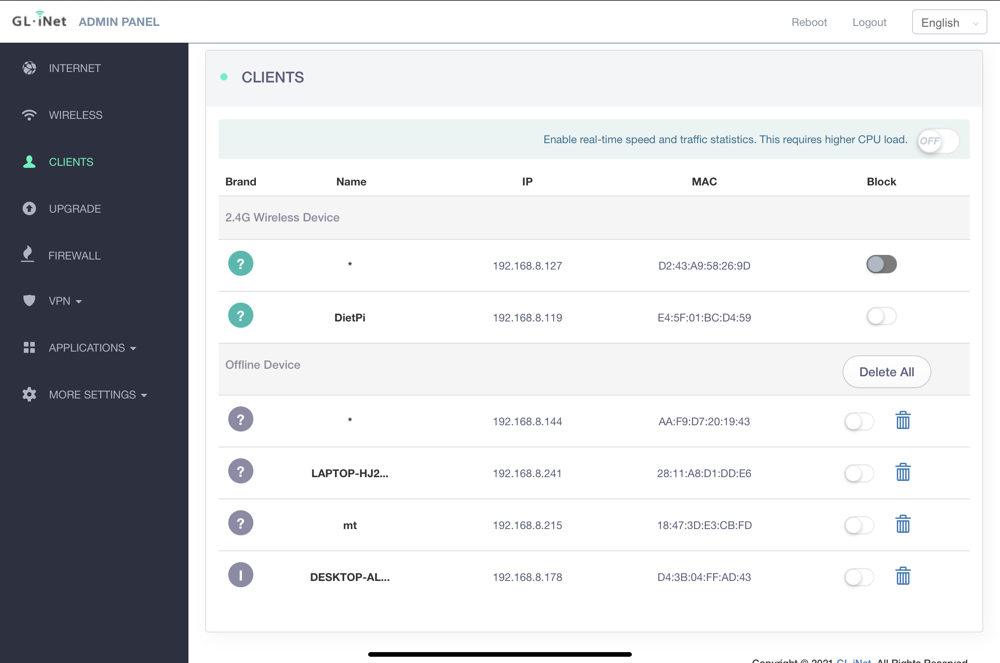
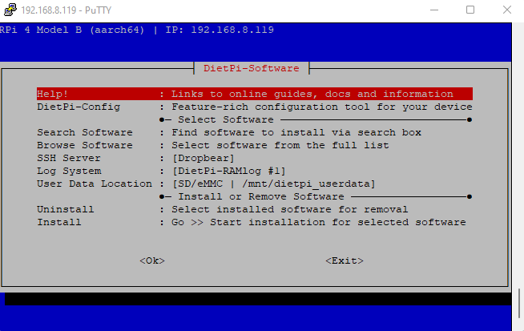

# RPI OS Router Setup
In this tutorial we will install a version of Linux onto the Raspberry Pi (RPi)
# Purpose
The purpose of this tutorial is to show the method in which to setup the RPi's operating system, DietPi.

# Prerequisites
To accomplish this tutorial, the following is needed
1. A laptop/PC to use as a development platform
2. A Raspberry Pi 4 B
3. A 32 GB micro SD card (8 GB will work, but 32 is recommended)
4. A router w/ config info. The SSID and WiFi password are needed to connect the RPi to the internet. For this tutorial, I am using a personal, portable router. To set up a personal router, follow the router tutorial found in the root folder of this repository.
[Link](../Setup_Router_Tutorial/README.md)

# My information
The setup I am using is as follows:
Router: GL.iNet GL-AR300M16-Ext Portable Mini Travel Wireless Pocket Router

https://www.amazon.com/dp/B07794JRC5?psc=1&ref=ppx_yo2ov_dt_b_product_details

Laptop: Gigabyte Aero 15 with Intel(R) Core(TM) i7-9750H CPU @ 2.60GHz 2.59 GHz with 16GB RAM running Windows 11 Pro.

Raspberry Pi: Raspberry Pi 4 Model B 2019 Quad Core 64 Bit with 4GB RAM and Cortex-A72 (ARM v8) processor.

# Setup
## 1. Setup the workspace on your computer
There are a few programs needed to do this tutorial. The first of which is an archive extractor. I prefer 7zip Archive Extractor. Found here: https://www.7-zip.org/.

Additionally, a program is needed to write to the SD card. For this tutorial, I used balenaEtcher... https://www.balena.io/etcher/

## 2. Download and configure DietPi
### Download DietPi
- Download DietPi from https://dietpi.com/#download.
- Select Raspberry Pi, then select the processor your Pi has. This can be found on the box the RPi came in, the manufacturers website, or the online store you bought the RPi from. 
    - My RPi is the ARMv8 64-bit processor.

- Save the .7z file and extract it to a folder of your choosing.

### Write the DietPi image to your micro SD card
- Open the SD card writer, in my case I am using balenaEtcher.
- Select flash from file, and navigate to the folder you extracted the DietPi image to. Select the *.img* file from the extracted files.
- Insert your micro SD card into your computer's SD card reader. You may need to use an micro SD card adapter. A Windows notification should appear indicating a new drive has been inserted.
- In Balena Etcher, click *select target* and select the drive you just inserted.


- Click *Flash!* and accept any Windows admin messages that appear. 
- Wait until flash is complete. Close Balena Etcher.

### Configure the boot image on the micro SD card
*Note: You may need to unplug and plug micro SD card back in.*

- Navigate to the micro SD card in Windows File Explorer. In the root folder of the micro SD, there are two files, *dietpi.txt* and *dietpi-wifi.txt*. Copy them to a local directory.
- Edit the *dietpi-wifi.txt* file. Change the following lines:
    - aWIFI_SSID[0]=''
    - aWIFI_KEY[0]=''
- Edit the lines to contain the SSID (case-sensitive) and Wi-Fi password for the router you wish to connect to.

- Open the *dietpi.txt* file. Here we will change our locale and other information needed by WiFi:
```
AUTO_SETUP_LOCALE=en_US.UTF-8
AUTO_SETUP_KEYBOARD_LAYOUT=us
AUTO_SETUP_TIMEZONE=America/New_York
AUTO_SETUP_NET_ETHERNET_ENABLED=0
AUTO_SETUP_NET_WIFI_ENABLED=1
AUTO_SETUP_NET_WIFI_COUNTRY_CODE=US
AUTO_SETUP_DHCP_TO_STATIC=1
AUTO_SETUP_NET_HOSTNAME=DietPi_{*initials*}
---- where initials are your initials
AUTO_SETUP_HEADLESS=1
AUTO_SETUP_AUTOSTART_TARGET_INDEX=1
SURVEY_OPTED_IN=0
CONFIG_SERIAL_CONSOLE_ENABLE=1
```
- Save the two files and copy them (if working locally) to the micro SD card.
- Eject the mico SD card. (right-click > eject)

### Install SD card into the RPi
- Locate the micro SD card slot on the pi (on the backside)
- Insert the micro SD card in the slot.
- The red light will turn on, and the green light will flash as the Pi boots.
- The Pi will finish its boot sequence when the green light stops flashing

#### Check for connectivity
- To check if the RPi has booted and connected to the network, login to the router's admin config page (192.168.8.1, for example). Navigate to clients and look for the RPi node we just set up.


### Connect remotely to the RPi
- Get the IP address of the Pi using the router's admin page. In the screenshot above, my Pi's address is 192.168.8.119
- Use SSH to connect to the Pi. I like to use Putty to do this, https://www.putty.org/.
- For the hostname/IP address, use the address from the client's page on the router. Click connect.

### Configuring the RPI using SSH
- Putty will open a SSH connection and ask you who to login as. Type *root*.
- When prompted for the password, type *dietpi*.
- When succesful, the Pi will a series of commands to setup the OS. The connection will terminate due to connection loss. This is the Pi restarting.
- Wait for the green light on the Pi to stop flashing and reconnect to the Pi using Putty. More updates will be run.

- The Pi will prompt you with a message asking you if you would like to change the root password used for installs, select OK and change the password.

- After changing the universal software password, the Pi will prompt if you would like to change the passwords for the root and default user, select OK and change this password.

- After changing this password, the Pi will prompt you about the serial console, select Yes.

- This is the final screen indicating you have finished this tutorial.

## Done
You can now move onto the software install tutorial.

[Link](./IOT_Platform_Install.md)

# References
https://github.com/pschragger/IOT_Tutorials_for_VU/tree/main/RPI_BOOT_WIFI_tutorial