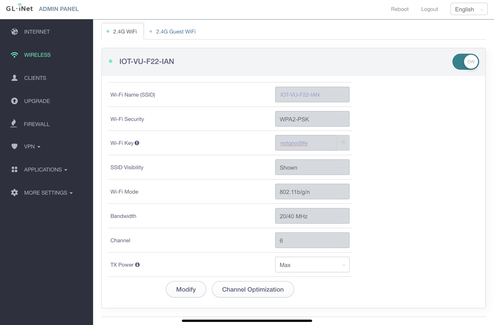

# Router Tutorial
This README serves as a tutorial for setting up a router. This tutorial serves for the GL-AR300M Series Mini Router.

## Getting Started
To begin, first plug in your router to a USB power source. 

## Connecting to the Router
Connect a device (with a web browser) to the router by selecting the GL-AR300M-*xxx* network. In my case, the network was called "GL-AR300M-17d-NOR". This SSID can also be located on the bottom of the router.

Use password *goodlife* to connect to the network. If this password does not work, reference the bottom of the router to find the "key".

Alternatively, you can use the included ethernet cable to connect the router to your device.

## Begin setting up the router
In a web browser, navigate to *https://192.168.8.1*

If this does not work! Open a command line and run the command *ipconfig -all*. Locate the IPv4 address and use the template *xxx.xxx.xxx.1* to navigate to the default gateway of the network.

### Selecting a language and password
After getting to the landing page for the router, select the preferred language from the dropdown menu and hit *next*.

On the next page, you will set an admin password. Use something easy to remember...

## Setting a new SSID
To differentiate your mini-router from others', we should set our own SSID for it.

On the main landing page. Click the router image at the top. Alternatively, click the "Wireless" tab on the left hand side. At the top of this page, there is a Wi-Fi Name (SSID) edit box. This box is unavailable.

Toward the bottom of the screen, select *Modify*. Now the SSID text box is available. Change it to whatever you wish. I changed mine to GL-AR300M-17d-IAN, so I know it's mine.

Additionally, you can change the WiFi key here. Otherwise, it will remain as the default *goodlife*.

### After changing the SSID
After changing the router's SSID, your device may disconnect from the network. This is because the key/password pair has changed.

Navigate back to the WiFi selection window and select your new network. Use the password from above or, if you changed the default password, use that instead.

Note: it may take a little while to show up again.

# Final Product
Attached below is an image of the Wireless edit screen. As seen below, the SSID and the WiFi-key have been changed to values different than the defaults.

